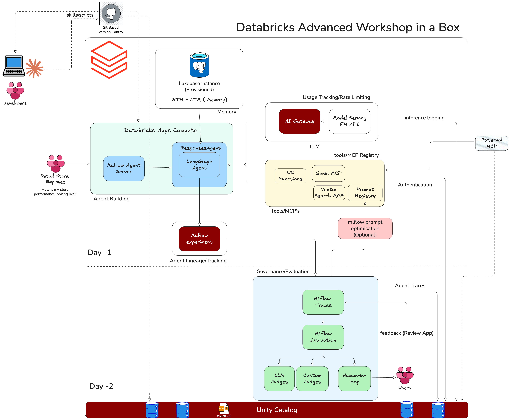

# 장기 메모리를 갖춘 리테일 식료품 AI 에이전트 (L300)

실시간 데이터 질의, 문서 검색(retrieval), 영구적인 사용자 메모리를 결합한 Databricks 기반 대화형 AI 에이전트입니다. 풀스택 Databricks App으로 배포합니다.



## 시작하기

| 경로 | 가이드 |
|------|-------|
| **로컬 개발** (본인 머신에서 uv, Node.js, CLI 사용) | [WORKSHOP_INSTRUCTIONS.md](./WORKSHOP_INSTRUCTIONS.md) |
| **워크스페이스 전용** (모든 작업을 Databricks 안에서, 로컬 설정 불필요) | [WORKSHOP_INSTRUCTIONS_WORKSPACE.md](./WORKSHOP_INSTRUCTIONS_WORKSPACE.md) |

## 주요 명령어

| 명령어 | 설명 |
|---------|-------------|
| `uv run quickstart` | 대화형 설정 마법사 |
| `uv run start-app` | 에이전트 서버 + 채팅 UI 시작 |
| `uv run start-server` | 에이전트 서버만 시작 |
| `uv run agent-evaluate` | 평가 스위트 실행 |
| `uv run discover-tools` | 사용 가능한 Databricks 툴 탐색 |

## 프로젝트 구조

```
advanced/
├── agent_server/
│   ├── agent.py            # Core agent: LLM, tools, invoke/stream
│   ├── utils_memory.py     # Memory tools (user prefs, tasks, conversations)
│   └── utils.py            # Auth, threading, streaming helpers
├── scripts/
│   ├── quickstart.py       # Setup wizard
│   └── start_app.py        # Starts frontend + backend
├── databricks.yml          # Asset Bundle config (deployment)
├── app.yaml                # Databricks App manifest
└── .env.example            # Environment variable template
```
