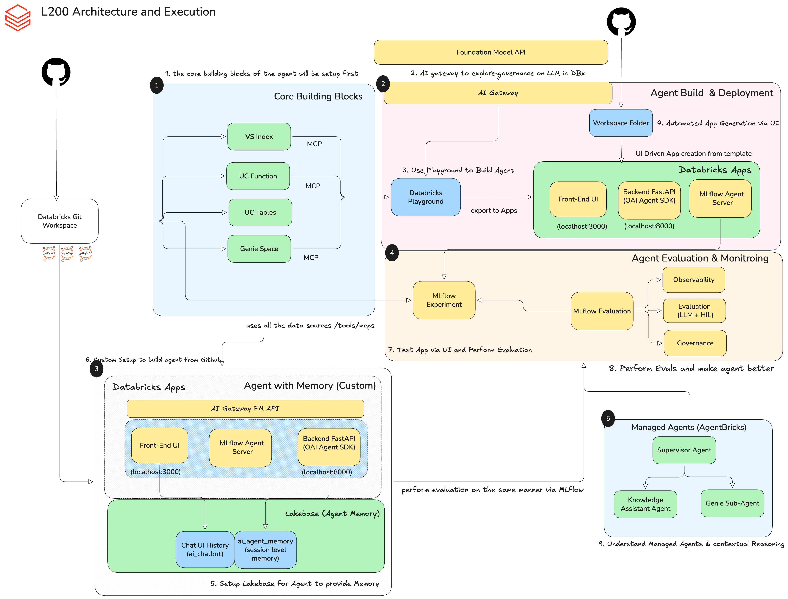

# Databricks에서 메모리를 갖춘 AI 에이전트 구축하기 (L200)

OpenAI Agents SDK와 Genie, Vector Search, Lakebase 메모리를 사용하는 AI 기반 대화형 에이전트입니다 — 풀스택 Databricks App으로 배포됩니다.



## 시작하기

| 경로 | 가이드 |
|------|-------|
| **로컬 개발** (로컬 머신에 uv, Node.js, CLI 설치) | [WORKSHOP_INSTRUCTIONS.md](./WORKSHOP_INSTRUCTIONS.md) |
| **워크스페이스 전용** (모든 작업을 Databricks 안에서, 로컬 설정 불필요) | [WORKSHOP_INSTRUCTIONS_WORKSPACE.md](./WORKSHOP_INSTRUCTIONS_WORKSPACE.md) |

## 빠른 명령어

| 명령어 | 설명 |
|---------|-------------|
| `uv run quickstart` | 대화형 설정 마법사 |
| `uv run start-app` | 에이전트 서버 + 챗 UI 시작 |
| `uv run start-server` | 에이전트 서버만 시작 |
| `uv run agent-evaluate` | 평가 스위트 실행 |
| `uv run discover-tools` | 사용 가능한 Databricks 툴 탐색 |

## 프로젝트 구조

```
medium/
├── agent_server/
│   ├── agent.py              # 에이전트 정의 — 모델, 툴, 시스템 프롬프트
│   ├── start_server.py       # FastAPI 서버 + MLflow 트레이싱 설정
│   ├── evaluate_agent.py     # MLflow 스코어러 기반 평가 스크립트
│   └── utils.py              # Lakebase 메모리, MCP 헬퍼
├── e2e-chatbot-app-next/     # 풀스택 챗 UI (Next.js + Express)
├── scripts/
│   ├── quickstart.py         # 원커맨드 환경 설정
│   ├── discover_tools.py     # 사용 가능한 워크스페이스 리소스 탐색
│   └── lakebase_setup_script.ipynb  # Lakebase 구성 헬퍼
├── databricks.yml            # 배포 설정 (Asset Bundle)
├── app.yaml                  # Databricks App 매니페스트
└── .env.example              # 환경 변수 템플릿
```
